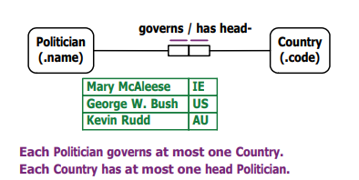

# Week 2

### TLDR;

This week we cover the first 3 steps of CSDP:

| Step | Description                                                                             |
| ---- | --------------------------------------------------------------------------------------- |
| 1.   | Transform familiar information examples into elementary facts, and apply quality checks |
| 2.   | Draw the fact types, and apply a population check                                       |
| 3.   | Check for entity types that should be combined, and note any arithmetic derivations     |

## Week 2 Content:

### Elementary Facts

An elementary fact is a simple assertion, or atomic proposition, about the domain.

Essentially, elementary facts are atomic. They cannot be split.

Examples of Elementary Facts are as follows:

* The **Patient** with surname ‘Lee’ has a **Temperature** of 37 Celsius.
* **Student** with the name 'Jane' was born in the **Year** '1990'.
* The **Athlete** with the name 'Jones EM' pole-vaults the **Height** of 400cm.

Elementary facts usually do not use logical connectives (e.g., not, and, or, if) or logical quantifiers (e.g., all, some).

Examples of incorrect Elementary Facts are as follows:

* Ann smokes **and** Bob smokes. - (Illegal, utilises logical conjunction).
* **All** people who smoke are cancer-prone. - (Illegal, utilises a logical quantifier).
* **If** Bob smokes **then** Bob is cancer-prone. - (Illegal, the statement is a conditional fact).

### Conceptual Modelling Method & Conceptual Schema Design Procedure (CSDP),

A **conceptual modelling method** comprises both a _modelling language_ and a _procedure_ describing how to use the language to build models.

A specification can be developed at the conceptual level using **Object-Role Modelling** (ORM).

The CSDP is performed in seven distinct steps:

| Step | Description                                                                 |
| ---- | --------------------------------------------------------------------------- |
| 1    | Transform familiar examples into elementary facts, and apply quality checks |
| 2    | Draw the fact types, and apply a population check                           |
| 3    | Check for entity types to be combined, and note any arithmetic derivations  |
| 4    | Add uniqueness constraints, and check the arity (length) of fact types      |
| 5    | Add mandatory role constraints, and check for logical derivations           |
| 6    | Add value, set-comparison and subtyping constraints                         |
| 7    | Add other constraints and perform final checks                              |

This week we only cover steps 1-3. If you would like to see an explanation of steps 4-7, please visit [Week 3](week-3.md).

### Basic Objects

Elementary facts assert that **objects** play roles. **Values** and **Entities** are basic objects.

#### Values:

A value is a constant that is self-identifying in the sense that when you see the constant written down in some context you always know what is being referred to. As a result, values can be referenced directly without identifying them with a description.

* E.g. character strings ('USA', 'Australia') and numbers (37, 5.38) are all values.

#### Entity:

An entity may be a tangible object (the City named ‘Brisbane’) or an abstract object (the Unit with code ‘IAB201’).

* E.g. - Australia has six states, "Australia" has nine letters.

**Reference Mode:**

There are instances throughout the domain which can create potential confusion. For example, consider two individuals - "Lee Jones" and "Mary Lee", with the sentence: "The Patient ‘Lee’ has a Temperature of 37."

This can lead to confusion about which 'Lee' is being referred to. This is resolved with the Reference Mode (i.e., how the value refers to the entity).

### Predicates & Arities&#x20;

In logic, a **predicate** is a declarative sentence with object holes in it. To complete the sentence, the _object holes_ are filled in by _object terms_. Whereas the **arity** of the predicate tells us how many ‘object holes’ the sentence has.

* A **unary** predicate has one, e.g., Ann studies ( …… studies)&#x20;
* A **binary** predicate has two, e.g., ..….. works in ..…..&#x20;
* A **ternary** predicate has three, e.g., ….. obtains a grade of ….. for …..

Although there can be various amounts of predicates, students should only need to use unary, binary or ternary predicates. ****&#x20;

### Semantic Equivalence & Fact Type Instances

The Employee with employee name "Mary Smith" __ works in the Department with department name 'Sales'. \
\
_The above is semantically equivalent to:_\
__The Department __ with department name 'Sales' employs the Employee with employee name "Mary Smith". \
\
The existence of the role "_works in_" necessarily implies the existence of the role "_employs_".\
Both roles are said to belong to a **fact type**; e.g. we can call this fact type DepartmentLocation.\
\
A fact type can have **multiple fact type instances**, which essentially means we can have multiple examples using the DepartmentLocation fact type to describe relationships in our domain.

### Surface Structures vs. Deep Structures

Where the arity of a predicate is greater than one, the predicate can be read in more than one way, for instance:

* Mary works in Sales&#x20;
* Sales employs Mary


... employs ... is the **** _inverse_ of ... works in ...&#x20;


The two predicates have different _**surface structures**_ but the same _**deep structure**_.\
We analyse the deep structure of the sentence to understand exactly what we're dealing with.

TBC.....

### Graphical/Tabular Representations

.png>)

.png>)

.png>)

.png>)
