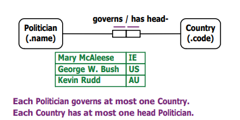

# Week 3

## TLDR;

This week we covered steps 4-7 of the CSDP process:

| Step | Description                                                            |
| ---- | ---------------------------------------------------------------------- |
| 4    | Add uniqueness constraints, and check the arity (length) of fact types |
| 5    | Add mandatory role constraints, and check for logical derivations      |
| 6    | Add value, set-comparison and subtyping constraints                    |
| 7    | Add other constraints and perform final checks                         |

## CSDP Step 4

### Uniqueness Constraints

Uniqueness Constraints are used to derive mapping types.

* The term 'n roles' constraint denotes a constraint which spans n roles. An n-ary fact type should have exactly one uniqueness constraint that spans the whole fact type or at least one uniqueness constraint which spans at least n-1 roles.

Uniqueness Constraints follow one of four types of mapping:

**One-to-One mapping (1:1)**

**Many-to-One Mapping (n:1) and One-to-Many (essentially opposite of)**

.png>)

#### Many-to-Many (n:n)

.png>)

**Ternary Uniqueness Constraint Examples**

.png>)

Note: The row of dots in the top-right example indicate the uniqueness constraint lines spanning Member and Motion form a single uniqueness constraint spanning both of the roles.\
\
Thus, this is equivalent to having Member and Motion adjacent, with a single uniqueness constraint (line) spanning both.\

**Spanning Rule**

In a nested fact type, the uniqueness constraints must span all of its roles.

CSDP Step 5\

### Mandatory Role Constraints

In Step 5 of the CSDP, each role is classified as **mandatory** or **optional**.

A **mandatory role constraint** is present on a role of an object type if every instance of that object type must be involved in that role.

A **mandatory role constraint** is present on a set of roles of an object type if every instance of that object type must be involved in at least one of roles in the set.

To indicate explicitly that a role is mandatory, we add a **mandatory role dot** to the line that connects the role to its object type.
